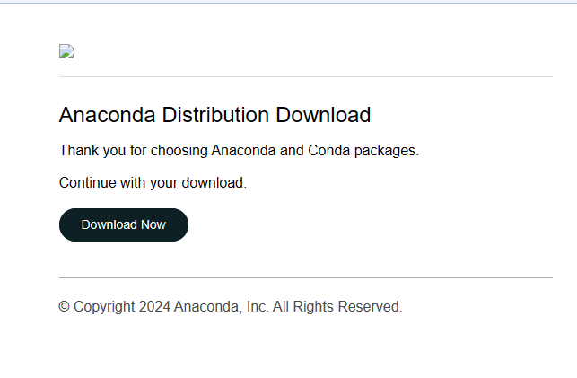
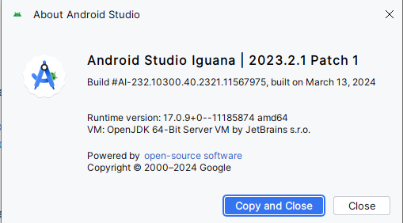
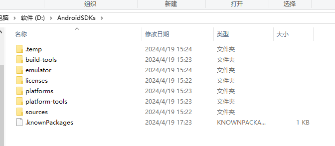
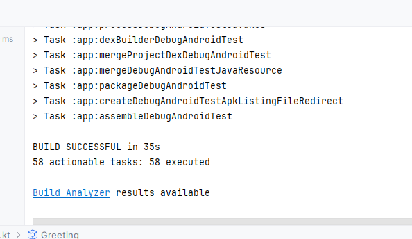
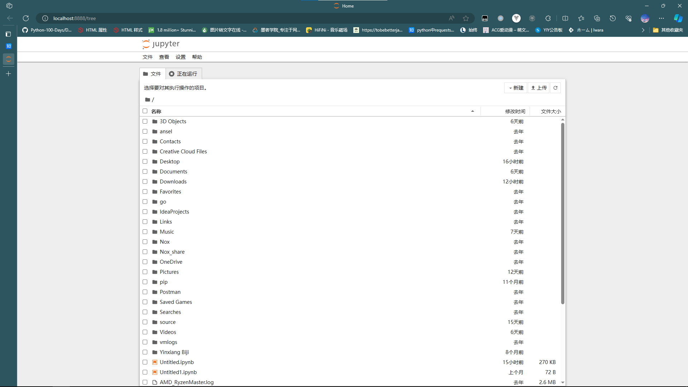
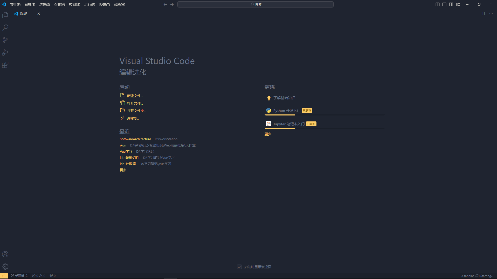

# 软件开发实践实验报告1

[toc]

##  Android Studio 安装

- 从 [Android Studio 官网]([Install Android Studio  | Android Developers (google.cn)](https://developer.android.google.cn/studio/install))获取下载链接：

  

- 安装 Android Studio：

  

- 安装 Android SDK：

  

- 初始化项目

- 初始化 Gradle 配置

- 完成

  

## Jupyter Notebook 安装和使用

## Visual Studio Code 安装和使用

