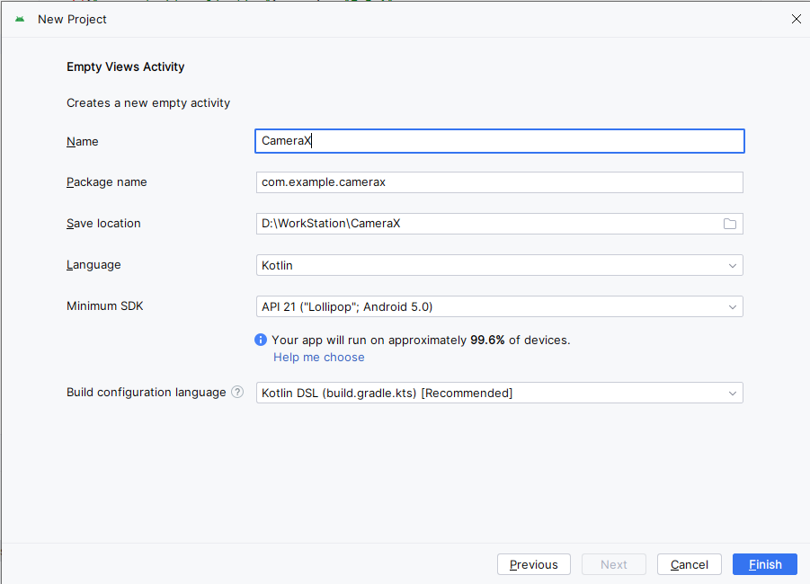
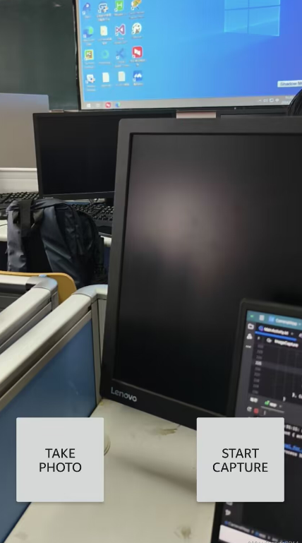

# 软件开发实践实验报告2-2：构建CameraX应用

[toc]

## 创建项目



## 在build.gradle(Module)文件中添加 CameraX 依赖项

```
    val camerax_version = "1.3.0-alpha04"
    implementation("androidx.camera:camera-core:$camerax_version")
    implementation("androidx.camera:camera-camera2:${camerax_version}")
    implementation("androidx.camera:camera-lifecycle:${camerax_version}")
    implementation("androidx.camera:camera-video:${camerax_version}")

    implementation("androidx.camera:camera-view:${camerax_version}" )
    implementation("androidx.camera:camera-extensions:${camerax_version}")

    //accompanist处理权限依赖库
    val accompanist_version = "0.31.2-alpha"
    implementation("com.google.accompanist:accompanist-permissions:$accompanist_version")
```

## 在android{}内添加viewBinding

```
    buildFeatures {
        viewBinding = true
    }
```

## 将activity_main文件替换为以下代码

```
<?xml version="1.0" encoding="utf-8"?>
<androidx.constraintlayout.widget.ConstraintLayout
    xmlns:android="http://schemas.android.com/apk/res/android"
    xmlns:app="http://schemas.android.com/apk/res-auto"
    xmlns:tools="http://schemas.android.com/tools"
    android:layout_width="match_parent"
    android:layout_height="match_parent"
    tools:context=".MainActivity">

    <androidx.camera.view.PreviewView
        android:id="@+id/viewFinder"
        android:layout_width="match_parent"
        android:layout_height="match_parent" />

    <Button
        android:id="@+id/image_capture_button"
        android:layout_width="110dp"
        android:layout_height="110dp"
        android:layout_marginBottom="50dp"
        android:layout_marginEnd="50dp"
        android:elevation="2dp"
        android:text="@string/take_photo"
        app:layout_constraintBottom_toBottomOf="parent"
        app:layout_constraintLeft_toLeftOf="parent"
        app:layout_constraintEnd_toStartOf="@id/vertical_centerline" />

    <Button
        android:id="@+id/video_capture_button"
        android:layout_width="110dp"
        android:layout_height="110dp"
        android:layout_marginBottom="50dp"
        android:layout_marginStart="50dp"
        android:elevation="2dp"
        android:text="@string/start_capture"
        app:layout_constraintBottom_toBottomOf="parent"
        app:layout_constraintStart_toEndOf="@id/vertical_centerline" />

    <androidx.constraintlayout.widget.Guideline
        android:id="@+id/vertical_centerline"
        android:layout_width="wrap_content"
        android:layout_height="wrap_content"
        android:orientation="vertical"
        app:layout_constraintGuide_percent=".50" />

</androidx.constraintlayout.widget.ConstraintLayout>
```

## 更新strings.xml 文件

```
<resources>
    <string name="app_name">CameraXApp</string>
    <string name="take_photo">Take Photo</string>
    <string name="start_capture">Start Capture</string>
    <string name="stop_capture">Stop Capture</string>
</resources>
```

## 将 MainActivity.kt 中的代码替换为以下代码

```
package com.android.example.cameraxapp

import android.Manifest
import android.content.ContentValues
import android.content.pm.PackageManager
import android.os.Build
import android.os.Bundle
import android.provider.MediaStore
import androidx.appcompat.app.AppCompatActivity
import androidx.camera.core.ImageCapture
import androidx.camera.video.Recorder
import androidx.camera.video.Recording
import androidx.camera.video.VideoCapture
import androidx.core.app.ActivityCompat
import androidx.core.content.ContextCompat
import com.android.example.cameraxapp.databinding.ActivityMainBinding
import java.util.concurrent.ExecutorService
import java.util.concurrent.Executors
import android.widget.Toast
import androidx.camera.lifecycle.ProcessCameraProvider
import androidx.camera.core.Preview
import androidx.camera.core.CameraSelector
import android.util.Log
import androidx.camera.core.ImageAnalysis
import androidx.camera.core.ImageCaptureException
import androidx.camera.core.ImageProxy
import androidx.camera.video.FallbackStrategy
import androidx.camera.video.MediaStoreOutputOptions
import androidx.camera.video.Quality
import androidx.camera.video.QualitySelector
import androidx.camera.video.VideoRecordEvent
import androidx.core.content.PermissionChecker
import java.nio.ByteBuffer
import java.text.SimpleDateFormat
import java.util.Locale

typealias LumaListener = (luma: Double) -> Unit

class MainActivity : AppCompatActivity() {
    private lateinit var viewBinding: ActivityMainBinding

    private var imageCapture: ImageCapture? = null

    private var videoCapture: VideoCapture<Recorder>? = null
    private var recording: Recording? = null

    private lateinit var cameraExecutor: ExecutorService

    override fun onCreate(savedInstanceState: Bundle?) {
        super.onCreate(savedInstanceState)
        viewBinding = ActivityMainBinding.inflate(layoutInflater)
        setContentView(viewBinding.root)

        // Request camera permissions
        if (allPermissionsGranted()) {
            startCamera()
        } else {
            ActivityCompat.requestPermissions(
                this, REQUIRED_PERMISSIONS, REQUEST_CODE_PERMISSIONS)
        }

        // Set up the listeners for take photo and video capture buttons
        viewBinding.imageCaptureButton.setOnClickListener { takePhoto() }
        viewBinding.videoCaptureButton.setOnClickListener { captureVideo() }

        cameraExecutor = Executors.newSingleThreadExecutor()
    }

    private fun takePhoto() {}

    private fun captureVideo() {}

    private fun startCamera() {}

    private fun allPermissionsGranted() = REQUIRED_PERMISSIONS.all {
        ContextCompat.checkSelfPermission(
            baseContext, it) == PackageManager.PERMISSION_GRANTED
    }

    override fun onDestroy() {
        super.onDestroy()
        cameraExecutor.shutdown()
    }

    companion object {
        private const val TAG = "CameraXApp"
        private const val FILENAME_FORMAT = "yyyy-MM-dd-HH-mm-ss-SSS"
        private const val REQUEST_CODE_PERMISSIONS = 10
        private val REQUIRED_PERMISSIONS =
            mutableListOf (
                Manifest.permission.CAMERA,
                Manifest.permission.RECORD_AUDIO
            ).apply {
                if (Build.VERSION.SDK_INT <= Build.VERSION_CODES.P) {
                    add(Manifest.permission.WRITE_EXTERNAL_STORAGE)
                }
            }.toTypedArray()
    }
}
```

## 更新androidManifest.xml

```
<?xml version="1.0" encoding="utf-8"?>
<manifest xmlns:android="http://schemas.android.com/apk/res/android"
    xmlns:tools="http://schemas.android.com/tools">
    <uses-feature android:name="android.hardware.camera.any" />
    <uses-permission android:name="android.permission.CAMERA" />
    <uses-permission android:name="android.permission.RECORD_AUDIO" />
    <uses-permission android:name="android.permission.WRITE_EXTERNAL_STORAGE"
        android:maxSdkVersion="28" />

    <application
        android:allowBackup="true"
        android:dataExtractionRules="@xml/data_extraction_rules"
        android:fullBackupContent="@xml/backup_rules"
        android:icon="@mipmap/ic_launcher"
        android:label="@string/app_name"
        android:roundIcon="@mipmap/ic_launcher_round"
        android:supportsRtl="true"
        android:theme="@style/Theme.CameraXApp"
        tools:targetApi="31">
        <activity
            android:name=".MainActivity"
            android:exported="true"
            android:label="@string/app_name"
            android:theme="@style/Theme.CameraXApp">
            <intent-filter>
                <action android:name="android.intent.action.MAIN" />

                <category android:name="android.intent.category.LAUNCHER" />
            </intent-filter>
        </activity>
    </application>

</manifest>
```

## 在MainActivity.kt中添加以下代码

```
override fun onRequestPermissionsResult(
        requestCode: Int, permissions: Array<String>, grantResults:
        IntArray) {
        if (requestCode == REQUEST_CODE_PERMISSIONS) {
            if (allPermissionsGranted()) {
                startCamera()
            } else {
                Toast.makeText(this,
                    "Permissions not granted by the user.",
                    Toast.LENGTH_SHORT).show()
                finish()
            }
        }
    }
```

## 填充startCamera()代码

```
private fun startCamera() {
   val cameraProviderFuture = ProcessCameraProvider.getInstance(this)

   cameraProviderFuture.addListener({
       // Used to bind the lifecycle of cameras to the lifecycle owner
       val cameraProvider: ProcessCameraProvider = cameraProviderFuture.get()

       // Preview
       val preview = Preview.Builder()
          .build()
          .also {
              it.setSurfaceProvider(viewBinding.viewFinder.surfaceProvider)
          }

       // Select back camera as a default
       val cameraSelector = CameraSelector.DEFAULT_BACK_CAMERA

       try {
           // Unbind use cases before rebinding
           cameraProvider.unbindAll()

           // Bind use cases to camera
           cameraProvider.bindToLifecycle(
               this, cameraSelector, preview)

       } catch(exc: Exception) {
           Log.e(TAG, "Use case binding failed", exc)
       }

   }, ContextCompat.getMainExecutor(this))
}
```

## 实现拍照功能

```kotlin
private fun takePhoto() {
   // Get a stable reference of the modifiable image capture use case
   val imageCapture = imageCapture ?: return

   // Create time stamped name and MediaStore entry.
   val name = SimpleDateFormat(FILENAME_FORMAT, Locale.US)
              .format(System.currentTimeMillis())
   val contentValues = ContentValues().apply {
       put(MediaStore.MediaColumns.DISPLAY_NAME, name)
       put(MediaStore.MediaColumns.MIME_TYPE, "image/jpeg")
       if(Build.VERSION.SDK_INT > Build.VERSION_CODES.P) {
           put(MediaStore.Images.Media.RELATIVE_PATH, "Pictures/CameraX-Image")
       }
   }

   // Create output options object which contains file + metadata
   val outputOptions = ImageCapture.OutputFileOptions
           .Builder(contentResolver,
                    MediaStore.Images.Media.EXTERNAL_CONTENT_URI,
                    contentValues)
           .build()

   // Set up image capture listener, which is triggered after photo has
   // been taken
   imageCapture.takePicture(
       outputOptions,
       ContextCompat.getMainExecutor(this),
       object : ImageCapture.OnImageSavedCallback {
           override fun onError(exc: ImageCaptureException) {
               Log.e(TAG, "Photo capture failed: ${exc.message}", exc)
           }

           override fun
               onImageSaved(output: ImageCapture.OutputFileResults){
               val msg = "Photo capture succeeded: ${output.savedUri}"
               Toast.makeText(baseContext, msg, Toast.LENGTH_SHORT).show()
               Log.d(TAG, msg)
           }
       }
   )
}
```

## 实现 ImageAnalysis 用例


```kotlin
private class LuminosityAnalyzer(private val listener: LumaListener) : ImageAnalysis.Analyzer {

   private fun ByteBuffer.toByteArray(): ByteArray {
       rewind()    // Rewind the buffer to zero
       val data = ByteArray(remaining())
       get(data)   // Copy the buffer into a byte array
       return data // Return the byte array
   }

   override fun analyze(image: ImageProxy) {

       val buffer = image.planes[0].buffer
       val data = buffer.toByteArray()
       val pixels = data.map { it.toInt() and 0xFF }
       val luma = pixels.average()

       listener(luma)

       image.close()
   }
}
```


## 更新startCamera()方法


```kotlin
private fun startCamera() {
   val cameraProviderFuture = ProcessCameraProvider.getInstance(this)

   cameraProviderFuture.addListener({
       // Used to bind the lifecycle of cameras to the lifecycle owner
       val cameraProvider: ProcessCameraProvider = cameraProviderFuture.get()

       // Preview
       val preview = Preview.Builder()
           .build()
           .also {
               it.setSurfaceProvider(viewBinding.viewFinder.surfaceProvider)
           }

       imageCapture = ImageCapture.Builder()
           .build()

       val imageAnalyzer = ImageAnalysis.Builder()
           .build()
           .also {
               it.setAnalyzer(cameraExecutor, LuminosityAnalyzer { luma ->
                   Log.d(TAG, "Average luminosity: $luma")
               })
           }

       // Select back camera as a default
       val cameraSelector = CameraSelector.DEFAULT_BACK_CAMERA

       try {
           // Unbind use cases before rebinding
           cameraProvider.unbindAll()

           // Bind use cases to camera
           cameraProvider.bindToLifecycle(
               this, cameraSelector, preview, imageCapture, imageAnalyzer)

       } catch(exc: Exception) {
           Log.e(TAG, "Use case binding failed", exc)
       }

   }, ContextCompat.getMainExecutor(this))
}
```


## 编写录制视频的captureVideo() 方法


```kotlin
// Implements VideoCapture use case, including start and stop capturing.
private fun captureVideo() {
   val videoCapture = this.videoCapture ?: return

   viewBinding.videoCaptureButton.isEnabled = false

   val curRecording = recording
   if (curRecording != null) {
       // Stop the current recording session.
       curRecording.stop()
       recording = null
       return
   }

   // create and start a new recording session
   val name = SimpleDateFormat(FILENAME_FORMAT, Locale.US)
              .format(System.currentTimeMillis())
   val contentValues = ContentValues().apply {
       put(MediaStore.MediaColumns.DISPLAY_NAME, name)
       put(MediaStore.MediaColumns.MIME_TYPE, "video/mp4")
       if (Build.VERSION.SDK_INT > Build.VERSION_CODES.P) {
           put(MediaStore.Video.Media.RELATIVE_PATH, "Movies/CameraX-Video")
       }
   }

   val mediaStoreOutputOptions = MediaStoreOutputOptions
       .Builder(contentResolver, MediaStore.Video.Media.EXTERNAL_CONTENT_URI)
       .setContentValues(contentValues)
       .build()
   recording = videoCapture.output
       .prepareRecording(this, mediaStoreOutputOptions)
       .apply {
           if (PermissionChecker.checkSelfPermission(this@MainActivity,
                   Manifest.permission.RECORD_AUDIO) ==
               PermissionChecker.PERMISSION_GRANTED)
           {
               withAudioEnabled()
           }
       }
       .start(ContextCompat.getMainExecutor(this)) { recordEvent ->
           when(recordEvent) {
               is VideoRecordEvent.Start -> {
                   viewBinding.videoCaptureButton.apply {
                       text = getString(R.string.stop_capture)
                       isEnabled = true
                   }
               }
               is VideoRecordEvent.Finalize -> {
                   if (!recordEvent.hasError()) {
                       val msg = "Video capture succeeded: " +
                           "${recordEvent.outputResults.outputUri}"
                       Toast.makeText(baseContext, msg, Toast.LENGTH_SHORT)
                            .show()
                       Log.d(TAG, msg)
                   } else {
                       recording?.close()
                       recording = null
                       Log.e(TAG, "Video capture ends with error: " +
                           "${recordEvent.error}")
                   }
                   viewBinding.videoCaptureButton.apply {
                       text = getString(R.string.start_capture)
                       isEnabled = true
                   }
               }
           }
       }
}
```

## 完成


