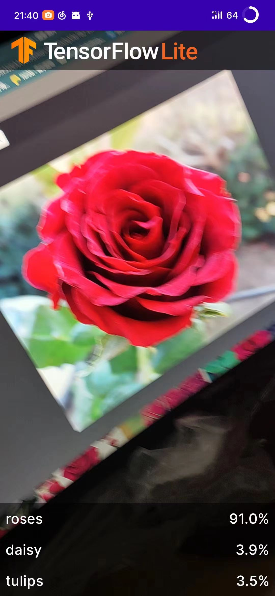
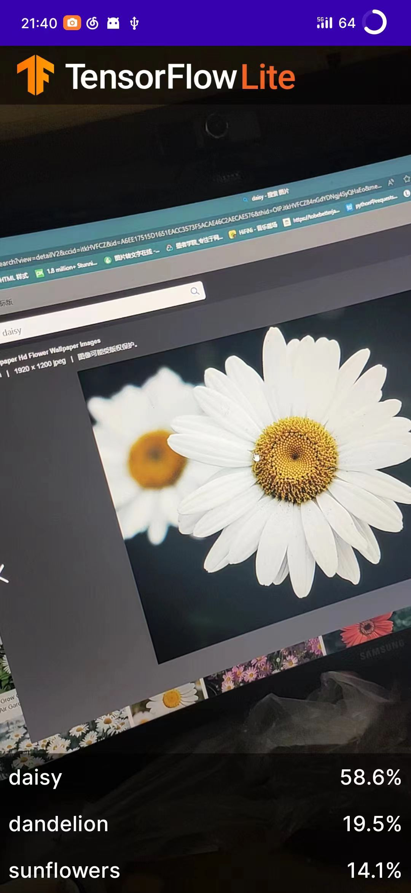

# 软件开发实践实验报告5-1：TFLite模型生成

[toc]

## 使用Codespace在线环境配置对应依赖库

```
!pip install tflite-model-maker
```

## 导入训练相关的库

```python
import os

import numpy as np

import tensorflow as tf
assert tf.__version__.startswith('2')

from tflite_model_maker import model_spec
from tflite_model_maker import image_classifier
from tflite_model_maker.config import ExportFormat
from tflite_model_maker.config import QuantizationConfig
from tflite_model_maker.image_classifier import DataLoader
```

## 训练模型

```python
import matplotlib.pyplot as plt

image_path = tf.keras.utils.get_file(
      'flower_photos.tgz',
      'https://storage.googleapis.com/download.tensorflow.org/example_images/flower_photos.tgz',
      extract=True)
image_path = os.path.join(os.path.dirname(image_path), 'flower_photos')

data = DataLoader.from_folder(image_path)
train_data, test_data = data.split(0.9)

model = image_classifier.create(train_data)

loss, accuracy = model.evaluate(test_data)

model.export(export_dir='.')
```

## 训练结果

```
INFO:tensorflow:Load image with size: 3670, num_label: 5, labels: daisy, dandelion, roses, sunflowers, tulips.
INFO:tensorflow:Retraining the models...
Model: "sequential"
_________________________________________________________________
 Layer (type)                Output Shape              Param #   
=================================================================
 hub_keras_layer_v1v2 (HubKe  (None, 1280)             3413024   
 rasLayerV1V2)                                                   
                                                                 
 dropout (Dropout)           (None, 1280)              0         
                                                                 
 dense (Dense)               (None, 5)                 6405      
                                                                 
=================================================================
Total params: 3,419,429
Trainable params: 6,405
Non-trainable params: 3,413,024
_________________________________________________________________
None
Epoch 1/5
2024-05-31 08:30:25.259288: W tensorflow/core/framework/cpu_allocator_impl.cc:82] Allocation of 51380224 exceeds 10% of free system memory.
2024-05-31 08:30:25.398426: W tensorflow/core/framework/cpu_allocator_impl.cc:82] Allocation of 51380224 exceeds 10% of free system memory.
2024-05-31 08:30:25.458219: W tensorflow/core/framework/cpu_allocator_impl.cc:82] Allocation of 51380224 exceeds 10% of free system memory.
2024-05-31 08:30:25.494412: W tensorflow/core/framework/cpu_allocator_impl.cc:82] Allocation of 154140672 exceeds 10% of free system memory.
2024-05-31 08:30:25.596098: W tensorflow/core/framework/cpu_allocator_impl.cc:82] Allocation of 57802752 exceeds 10% of free system memory.
103/103 [==============================] - 45s 427ms/step - loss: 0.8526 - accuracy: 0.7852
Epoch 2/5
103/103 [==============================] - 44s 427ms/step - loss: 0.6556 - accuracy: 0.8905
Epoch 3/5
103/103 [==============================] - 42s 410ms/step - loss: 0.6201 - accuracy: 0.9129
Epoch 4/5
103/103 [==============================] - 42s 409ms/step - loss: 0.5979 - accuracy: 0.9287
Epoch 5/5
103/103 [==============================] - 42s 404ms/step - loss: 0.5803 - accuracy: 0.9384
12/12 [==============================] - 6s 380ms/step - loss: 0.6484 - accuracy: 0.8883
2024-05-31 08:34:46.785365: W tensorflow/python/util/util.cc:368] Sets are not currently considered sequences, but this may change in the future, so consider avoiding using them.
INFO:tensorflow:Assets written to: /tmp/tmp2pmyrox8/assets
INFO:tensorflow:Assets written to: /tmp/tmp2pmyrox8/assets
2024-05-31 08:34:50.512632: I tensorflow/core/grappler/devices.cc:66] Number of eligible GPUs (core count >= 8, compute capability >= 0.0): 0
2024-05-31 08:34:50.512779: I tensorflow/core/grappler/clusters/single_machine.cc:358] Starting new session
2024-05-31 08:34:50.538566: I tensorflow/core/grappler/optimizers/meta_optimizer.cc:1164] Optimization results for grappler item: graph_to_optimize
  function_optimizer: Graph size after: 913 nodes (656), 923 edges (664), time = 14.51ms.
  function_optimizer: function_optimizer did nothing. time = 0.006ms.

/workspaces/codespaces-jupyter/.conda/lib/python3.8/site-packages/tensorflow/lite/python/convert.py:746: UserWarning: Statistics for quantized inputs were expected, but not specified; continuing anyway.
  warnings.warn("Statistics for quantized inputs were expected, but not "
2024-05-31 08:34:51.093277: W tensorflow/compiler/mlir/lite/python/tf_tfl_flatbuffer_helpers.cc:357] Ignored output_format.
2024-05-31 08:34:51.093326: W tensorflow/compiler/mlir/lite/python/tf_tfl_flatbuffer_helpers.cc:360] Ignored drop_control_dependency.
INFO:tensorflow:Label file is inside the TFLite model with metadata.
fully_quantize: 0, inference_type: 6, input_inference_type: 3, output_inference_type: 3
INFO:tensorflow:Label file is inside the TFLite model with metadata.
INFO:tensorflow:Saving labels in /tmp/tmpqsqn7fa5/labels.txt
INFO:tensorflow:Saving labels in /tmp/tmpqsqn7fa5/labels.txt
INFO:tensorflow:TensorFlow Lite model exported successfully: ./model.tflite
INFO:tensorflow:TensorFlow Lite model exported successfully: ./model.tflite
```

最终导出模型为model.tflite

## 替换原本模型，运行结果



